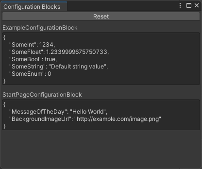

# Configuration Blocks

## Overview

Configuration Blocks provides a fast and easy way to configure your app both locally and remotely.

### You start with this:

```csharp
class StartPageConfigurationBlock : ConfigurationBlock
{
    public string MessageOfTheDay;
    public string BackgroundImageUrl;
}

void CreateStartPage()
{
    var config = configurationBlockProvider.Get<StartPageConfigurationBlock>();

    SetBackgroundImage(config.BackgroundImageUrl);
    ShowMessage(config.MessageOfTheDay);
}
```

### Then if you want Remote Config:

Connect your Remote Config provider, such as Firebase Remote Config:

```csharp
class FirebaseRemoteConfigAdapter : ConfigurationBlocks.IRemoteConfigAdapter
{
    public bool TryGetValue(string key, out string value)
    {
        value = Firebase.RemoteConfig.FirebaseRemoteConfig.GetValue(key).StringValue;
        return true;
    }
}

var configurationBlockProvider = new ConfigurationBlockProvider(new FirebaseRemoteConfigAdapter());
```

Then, in your Remote Config provider, add a json string value for the key `"StartPageConfigurationBlock"`:

```json
{
    "MessageOfTheDay": "Welcome to my app",
    "BackgroundImageUrl": "https://example.com/background.png"
}
```

### How it works

What actually happens behind the scenes is that Configuration Blocks will look up the json string value for key=NameOfYourConfigurationBlock from your Remote Config provider. If it exists, it will deserialize the json value into a an instance of your block's type using Unity's built-in JsonUtility. If it doesn't exist, it will default-construct a an instance.

### Custom keys for Configuration Blocks

You can implement your own `ConfigurationBlocks.IKeyProvider` to customize the key used to look up the json string value from your Remote Config provider.

```csharp
class CustomKeyProvider : ConfigurationBlocks.IKeyProvider
{
    public string GetKey<T>()
    {
        return typeof(T).Name + "Config";
    }
}

var configurationBlockProvider = new ConfigurationBlockProvider(keyProvider: new CustomKeyProvider());
```

### Configuration Blocks Window

Go to `Tools > Neuston > Configuration Blocks` to open the Configuration Blocks window.



This window shows you all the Configuration Blocks in your project, and the json string for the default values. The json string can be copied and pasted into your Remote Config provider.